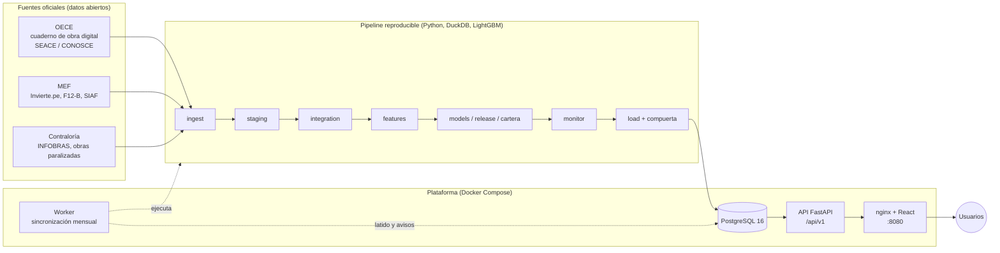
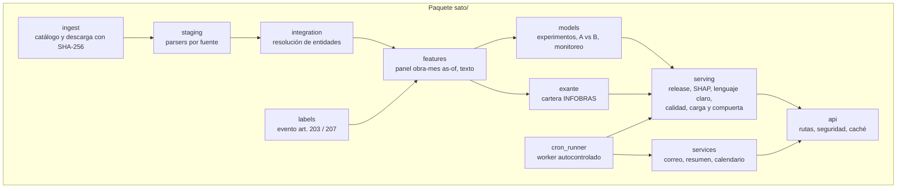
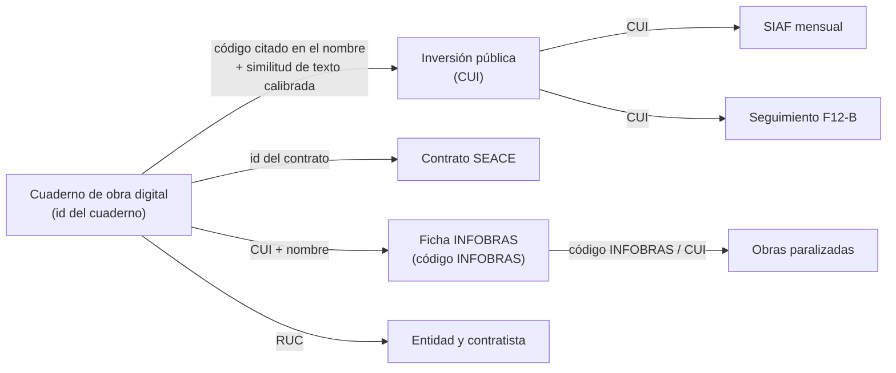
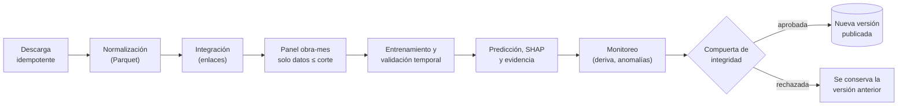
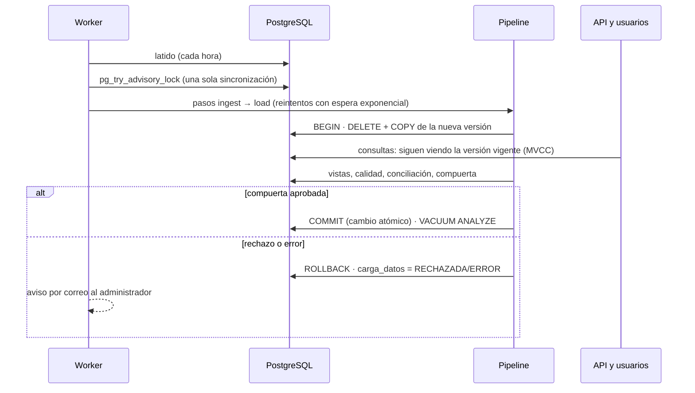
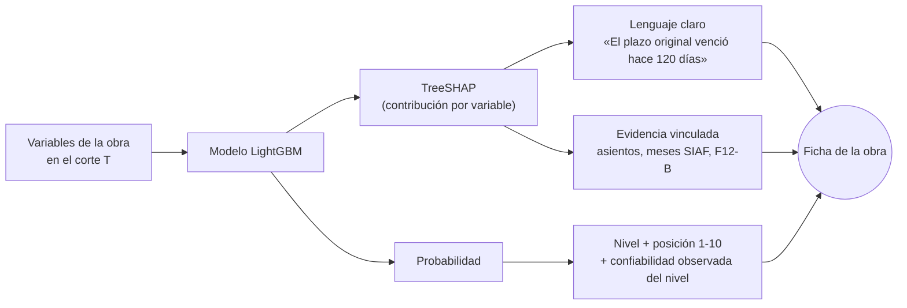
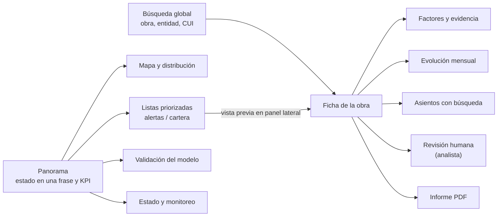

# SATO — Sistema de Alerta Temprana de Obras Públicas del Perú

SATO estima, **solo con datos abiertos oficiales del Estado peruano**, qué obras públicas en ejecución tienen mayor riesgo de
atrasarse, explica cada estimación en lenguaje claro y muestra los registros oficiales que la sustentan (asientos del cuaderno
de obra digital, gasto mensual del SIAF, fichas de INFOBRAS y del Banco de Inversiones), para que un supervisor, auditor o
ciudadano pueda verificarla.

Tesis de Ingeniería de Sistemas — Universidad Nacional de San Agustín de Arequipa (UNSA).

> Las estimaciones son probabilísticas y sirven para **priorizar la supervisión**. No determinan responsabilidades de ninguna
> entidad, funcionario o contratista.

---

## Contenido

1. [En una página](#1-en-una-página)
2. [El problema](#2-el-problema)
3. [Qué hace SATO](#3-qué-hace-sato)
4. [Arquitectura](#4-arquitectura)
5. [Fuentes oficiales e integración](#5-fuentes-oficiales-e-integración)
6. [Flujo de datos y ciclo de vida](#6-flujo-de-datos-y-ciclo-de-vida)
7. [Inteligencia artificial: modelos, validación y explicaciones](#7-inteligencia-artificial-modelos-validación-y-explicaciones)
8. [Operación autocontrolada](#8-operación-autocontrolada)
9. [Seguridad](#9-seguridad)
10. [Interfaz y flujo de usuario](#10-interfaz-y-flujo-de-usuario)
11. [Instalación y uso](#11-instalación-y-uso)
12. [Pruebas y validación](#12-pruebas-y-validación)
13. [Estructura del código](#13-estructura-del-código)
14. [Limitaciones](#14-limitaciones)
15. [Documentación relacionada](#15-documentación-relacionada)

---

## 1. En una página

| Pregunta | Respuesta |
|---|---|
| ¿Qué problema resuelve? | Los atrasos de las obras públicas se detectan cuando ya son costosos. La información para anticiparlos existe, pero está dispersa en portales distintos y sin identificadores comunes. |
| ¿Qué entrega? | Una lista priorizada de obras activas por riesgo, la explicación de cada estimación, la evidencia oficial que la respalda y la confiabilidad real de cada nivel de riesgo. |
| ¿Con qué datos? | Exclusivamente datos abiertos de OECE (cuaderno de obra digital, SEACE), MEF (Invierte.pe, Formato 12-B, SIAF) y Contraloría (INFOBRAS, obras paralizadas). Sin datos sintéticos. |
| ¿Para quién? | Supervisores e inspectores, órganos de control, entidades contratantes, investigadores y ciudadanía. |
| ¿Qué tan bien funciona? | Señal real y moderada: ROC-AUC 0,774 en la prueba ciega nacional del modelo de alerta; 77,5 % de las obras con atraso formal en la prueba recibieron alerta antes del hecho (mediana de 48,5 días de anticipación). |
| ¿Cómo se mantiene? | Sincronización mensual automática con compuerta de integridad, monitoreo de deriva del modelo y semáforo operativo. |

**Cobertura de la base cargada** (corte del cuaderno de obra digital 31-08-2026; cartera INFOBRAS con registros hasta
31-03-2026; archivos descargados el 25-09-2026 y registrados con su huella SHA-256):

| Dato | Cantidad |
|---|---|
| Contratos de obra con cuaderno de obra digital | 17 100 |
| Asientos del cuaderno de obra (texto completo, fechado y firmado) | 2 424 134 |
| Obras de la cartera nacional INFOBRAS | 139 159 |
| Inversiones públicas enlazadas (Invierte.pe) | 120 117 |
| Registros mensuales de gasto devengado (SIAF) | 1 406 371 |
| Registros de obras paralizadas (Contraloría) | 30 369 |
| Estimaciones de riesgo con explicación (alerta a 60 días) | 44 790 |
| Estimaciones de riesgo de la cartera | 224 155 |

## 2. El problema

La ejecución de obras es uno de los principales destinos de la inversión pública y, a la vez, una fuente recurrente de
sobrecostos, ampliaciones de plazo y paralizaciones (en junio de 2026 la Contraloría reportaba 2 262 obras paralizadas). Los
datos para anticiparlo son públicos pero difíciles de usar:

* el cuaderno de obra digital no registra el código único de inversión (CUI);
* INFOBRAS publica solo la situación actual de cada obra, no su historia;
* el SIAF publica el gasto por mes en archivos anuales de varios gigabytes;
* cada portal usa sus propios identificadores, formatos y codificaciones.

SATO integra esas fuentes, reconstruye la historia de cada obra **sin usar información posterior a cada fecha de corte** y la
convierte en una priorización que se puede verificar.

## 3. Qué hace SATO

| Función | Qué ve el usuario | Dónde |
|---|---|---|
| Panorama ejecutivo | Obras activas, monto comprometido, obras en riesgo alto y su distribución territorial | Panorama |
| Alerta a 60 días | Obras con cuaderno digital ordenadas por probabilidad de registrar el atraso formal (causal del 80 %) | Alertas del cuaderno |
| Riesgo de la cartera | Obras de cualquier modalidad con riesgo de terminar con retraso significativo | Cartera nacional |
| Ficha de obra | Nivel de riesgo, factores en lenguaje claro, evidencia documental, evolución mensual, asientos con búsqueda, revisión humana | Ficha |
| Informe técnico | PDF por obra con riesgo, factores, evidencia, sensibilidad y marco normativo | Ficha |
| Comparador | Departamentos y sectores con tasas históricas y alertas vigentes | Comparador |
| Validación | ¿Las probabilidades coinciden con lo ocurrido? ¿Qué tan confiable es cada nivel? | Validación del modelo |
| Transparencia de datos | Archivos fuente con huella, auditoría de calidad (32 chequeos), estado de las fuentes | Datos y fuentes |
| Estado y monitoreo | Semáforo operativo, historial de cargas con conciliación, deriva del modelo, anomalías | Estado y monitoreo |
| Suscripción | Resumen semanal por correo del ámbito elegido, con doble confirmación | Recibir alertas |

**El evento que se predice es un hito formal, no una interpretación.** Según el Reglamento de la Ley 30225 (D.S. 344-2018-EF,
art. 203) y el Reglamento de la Ley 32069 (D.S. 009-2025-EF, art. 207), cuando la valorización acumulada ejecutada es menor al
80 % de la programada el supervisor ordena un calendario acelerado y lo anota en el cuaderno de obra. El modelo de alerta
estima la probabilidad de que ese primer asiento ocurra en los próximos 60 días. Para la cartera INFOBRAS el evento es terminar
después de la fecha programada más un 30 % del plazo original.

**Ejemplo real de explicación.** Estimación vigente (corte 31-08-2026) de una obra de mejoramiento de espacios públicos en
Huaral (Lima), tal como está en la base; los textos los genera `sato/serving/lenguaje.py` a partir del valor de cada variable:

> Riesgo estimado de atraso formal en 60 días: **Alto**, posición 10 de 10 en el corte (probabilidad estimada 36,8 %,
> 6,6 veces el promedio de 5,6 %). Factores que lo elevan:
> 1. «Índice de alerta por las palabras usadas en los asientos recientes: 0.59 (escala de 0 a 1)»
> 2. «El 30 % de los asientos de los últimos 60 días menciona atraso, retraso o demora»
> 3. «El 3 % de los asientos de los últimos 60 días menciona penalidades, incumplimientos o cartas notariales»
>
> Confiabilidad del nivel: en la validación con datos pasados, 17,6 % de las obras en nivel alto registró el atraso formal en
> 60 días. «Ver evidencia» abre los asientos del cuaderno que sustentan cada factor.

## 4. Arquitectura



| Capa | Tecnología | Por qué |
|---|---|---|
| Procesamiento analítico | Python 3.12, DuckDB, Parquet, pandas | ~3 GB brutos en un solo equipo, sin servidor; los CSV anuales del SIAF se agregan en un minuto |
| Aprendizaje automático | LightGBM, TreeSHAP, Sentence-BERT, scikit-learn | Datos tabulares con nulos; explicaciones exactas por predicción; el aporte del texto se mide por ablación |
| Base de datos | PostgreSQL 16 (`pg_trgm`, `unaccent`, texto completo en español) | Integridad, búsqueda en los asientos, MVCC para recargar sin cortar la lectura |
| API | FastAPI, SQLAlchemy Core, Pydantic, PyJWT, bcrypt, slowapi, ReportLab | Validación estricta, OpenAPI automático, consultas parametrizadas |
| Interfaz | React 19, TypeScript, Vite, Tailwind, Radix UI, Recharts, Leaflet, TanStack Query | Componentes accesibles, carga diferida por página, estado en la URL |
| Entrega | Docker Compose, nginx, Caddy (HTTPS en producción) | Tres servicios, un trabajo de carga y un worker: sin necesidad de Kubernetes |

Detalle de componentes, modelo de datos y API: [docs/architecture/ARCHITECTURE.md](docs/architecture/ARCHITECTURE.md).

### Módulos



## 5. Fuentes oficiales e integración

| Fuente | Institución | Qué aporta | Limitación conocida |
|---|---|---|---|
| Cuaderno de obra digital (asientos, cuadernos, valorizaciones) | OECE | Historia fechada y firmada de cada obra; el evento objetivo | Publicado desde junio de 2024 |
| SEACE / CONOSCE | OECE | Contrato, monto y plazo contratados | Foto sin fecha: solo se usan campos fijados al inicio |
| Banco de Inversiones (Invierte.pe) y Formato 12-B | MEF | CUI, función, nivel de gobierno, monto viable, seguimiento de la ejecución | Coordenadas incompletas |
| SIAF (gasto devengado mensual) | MEF | Ejecución financiera mes a mes | Llega con un mes de rezago; el PIM del año en curso no está fechado |
| INFOBRAS | Contraloría | Cartera nacional de obras de cualquier modalidad, plazos y fechas | Solo la situación actual; 75 916 obras sin coordenadas |
| Reportes de obras paralizadas | Contraloría | Paralizaciones y su causal | Trimestral |



El enlace cuaderno → CUI se validó con 10 075 pares que traen el CUI explícito: precisión de 99,1 %. Cada archivo descargado
queda en `data/raw/manifest.jsonl` con URL, tamaño, fecha declarada por el servidor, fecha de descarga y SHA-256, y se publica
en «Datos y fuentes».

## 6. Flujo de datos y ciclo de vida





**Pasos del pipeline** (`python -m sato.pipeline <paso>`; cada uno lee solo las salidas del anterior y es idempotente):

| Paso | Salida |
|---|---|
| `ingest` | `data/raw/` y `manifest.jsonl` |
| `staging` | `data/staging/*.parquet` |
| `integration` | `data/curated/` (enlaces entre fuentes) |
| `features` | `data/features/` (panel obra-mes, léxico, LSA, extracción de información) |
| `embeddings` | `data/features/asiento_embeddings.npy` (Sentence-BERT, GPU recomendada) |
| `experiments` | `artifacts/experiments/` (grilla temporal, *rolling-origin*, A vs B) |
| `release` | `artifacts/release/` (modelo operativo, backtest *as-of*, SHAP, evidencia, sensibilidad) |
| `cartera_experimentos`, `cartera` | `artifacts/exante/`, `artifacts/cartera/` |
| `monitor` | `artifacts/monitoring/reporte.json` |
| `load` | PostgreSQL con validación, conciliación, auditoría de calidad y compuerta |

## 7. Inteligencia artificial: modelos, validación y explicaciones

Cada componente de IA tiene un propósito medible; no hay componentes decorativos.

| Componente | Propósito | Evidencia |
|---|---|---|
| LightGBM, modelo A (datos estructurados) | Línea base de la alerta a 60 días | ROC-AUC 0,742; PR-AUC 0,141 (prueba ciega nacional) |
| LightGBM, modelo B (A + texto de los asientos) | Alerta operativa | ROC-AUC 0,774; PR-AUC 0,159; diferencia con A: IC 95 % [0,019; 0,045] en ROC-AUC |
| Sentence-BERT, TF-IDF, léxico del dominio | Aporte del texto de los asientos | Ablación por bloque en `comparacion_A_vs_B.csv` |
| LightGBM de cartera (inicio y seguimiento SIAF) | Riesgo de retraso significativo de toda la cartera | ROC-AUC 0,733 al inicio y 0,753 con seguimiento mensual |
| TreeSHAP + capa de lenguaje claro | Explicar cada estimación con el dato real | 0 explicaciones con nombres internos (prueba de regresión) |
| Calibración por decil y nivel | Que la probabilidad pueda leerse literalmente | Decil superior: 20,0 % estimado frente a 17,7 % observado |
| PSI y desempeño realizado | Detectar deriva cuando cambian los datos | 8 variables con PSI > 0,25 en el corte vigente (publicado) |
| Puntaje z robusto de la proporción de nivel alto | Detectar un corte atípico antes de difundirlo | Corte vigente: 6,4 % frente a mediana de 10,4 % (z = −2,4, normal) |

### Prevención de fuga temporal

* Unidad de análisis: **obra-mes**. En cada fecha de corte *T* solo se usan datos con fecha ≤ *T* (el SIAF, con un mes de rezago).
* Se excluyen los campos que solo se conocen al final (avance, fecha real de término, estado actual de INFOBRAS).
* Entrenamiento, validación y prueba consecutivos en el tiempo, con purga de las observaciones cuya ventana cruza el límite.
  Hiperparámetros y umbrales se fijan en validación; la prueba es ciega.
* Pruebas automáticas en [`tests/test_no_leakage.py`](tests/test_no_leakage.py); política en
  [`docs/methodology/LEAKAGE_POLICY.md`](docs/methodology/LEAKAGE_POLICY.md).

### Resultados (prueba temporal ciega)

**Alerta a 60 días** (16 756 obra-mes de 5 158 obras; prevalencia 5,0 %):

| Métrica | Modelo A | Modelo B (operativo) |
|---|---|---|
| ROC-AUC | 0,742 | 0,774 |
| PR-AUC | 0,141 | 0,159 |
| Obras con atraso formal alertadas antes del hecho | — | 414 de 534 (77,5 %) |
| Anticipación mediana | — | 48,5 días |

En Arequipa la mejora del texto tiene la misma dirección, pero el tamaño de muestra no permite distinguirla de cero.

**Confiabilidad de los niveles** (backtest *as-of*: 39 038 obra-mes con resultado conocido):

| Nivel | Proporción que registró el atraso formal en 60 días |
|---|---|
| Alto | 17,6 % |
| Medio | 8,5 % |
| Bajo | 3,1 % |
| Promedio | 5,6 % |

**Cartera INFOBRAS** (prueba 2022-2025; retraso significativo al término):

| Modelo | ROC-AUC | PR-AUC | Retraso observado por nivel (alto / medio / bajo) |
|---|---|---|---|
| Inicio de la obra (LightGBM) | 0,733 | 0,759 | 78,3 % / 54,4 % / 32,7 % |
| Seguimiento mensual con SIAF (LightGBM) | 0,753 | 0,855 | 91,6 % / 69,7 % / 44,4 % |

En el modelo de inicio, el bosque aleatorio obtuvo en la prueba un ROC-AUC levemente mayor (0,741) que LightGBM (0,733); se
mantiene LightGBM en ambos modelos de la cartera por consistencia con el modelo de seguimiento, que es el que se aplica a las
obras activas. Las cifras completas por modelo están en `artifacts/cartera/cartera_card.json`.

### Explicaciones



El simulador de sensibilidad recalcula la probabilidad cambiando una señal a la vez. Muestra de qué depende la estimación;
no es un efecto causal.

## 8. Operación autocontrolada

| Mecanismo | Qué evita | Implementación |
|---|---|---|
| Validación de entradas | Cargar archivos incompletos o con otro esquema | `load_db.validar_entradas` |
| Conciliación de registros | Pérdida de registros sin explicación | `carga_datos.conciliacion`: origen, cargadas, descartadas y motivo |
| Compuerta de integridad | Publicar una versión rota | 11 chequeos críticos y caída máxima de 20 % en tablas clave, antes del `COMMIT` |
| Recarga sin corte de servicio | Dejar la plataforma sin lectura durante la carga | `DELETE` + MVCC + `REFRESH ... CONCURRENTLY` |
| Candado de sincronización | Dos sincronizaciones simultáneas | `pg_try_advisory_lock` |
| Reintentos | Fallas transitorias de red o de la base | Espera exponencial por paso; hasta 3 intentos por mes |
| Recuperación | Sincronizaciones interrumpidas | Se marcan como interrumpidas y se reintenta |
| Latido del worker | Worker detenido sin que nadie lo note | `servicio_latido` y aviso en el semáforo |
| Avisos | Fallos silenciosos | Correo a `SATO_ALERTAS_EMAIL`: fallo, rechazo, intentos agotados, deriva |
| Semáforo | Estado desconocido | `/api/v1/sistema/estado`: OPERATIVO, CON_AVISOS o DEGRADADO con motivos |

**Medición real (recarga completa del 29-09-2026).** La compuerta aprobó la carga sin hallazgos críticos ni caídas; la
conciliación registró, entre otros, 2 732 592 asientos de origen, 2 424 134 cargados y 308 458 descartados (cuadernos sin
metadatos del contrato o asientos repetidos). La carga tomó 22 min y el mantenimiento posterior 4 min; durante esos 26,8 min
la API respondió **417 de 417** solicitudes de un sondeo cada 5 s, con mediana de 2,1 s (en el mismo equipo, sin carga, las
mismas consultas responden en menos de 0,2 s): el servicio se mantiene, más lento, porque la base, la carga y la API comparten
el disco. Detalle en [`artifacts/disponibilidad_durante_carga.json`](artifacts/disponibilidad_durante_carga.json).

## 9. Seguridad

Defensa en profundidad; cada control tiene una prueba automática.

| Riesgo | Control |
|---|---|
| Inyección SQL | Solo consultas parametrizadas; búsqueda literal con comodines escapados |
| Fuerza bruta | Límite de nginx (10 solicitudes/min en ingreso) y bloqueo en la API tras 5 fallos por cuenta en 15 min |
| Enumeración de cuentas y suscriptores | Mismo mensaje y mismo costo bcrypt exista o no la cuenta; respuesta uniforme en suscripciones |
| Sesiones | JWT HS256 con emisor, `nbf` y `exp`; rol leído de la base en cada solicitud; cierre automático al vencer |
| Autorización | Roles `analista` y `admin`; rutas de administración solo para `admin` |
| XSS | React escapa todo; CSP `script-src 'self'`; enlaces externos solo http(s) |
| CSRF | No aplica: el token viaja en la cabecera `Authorization`, no en cookies |
| Falsificación de IP y de enlaces | nginx solo acepta `X-Forwarded-For` del proxy de producción y lo reemplaza hacia la API; los correos usan `SATO_BASE_URL`, nunca la cabecera `Host` |
| Fuga de información | Errores 500 y 503 genéricos; mensajes internos solo para `admin`; `Cache-Control: no-store` en respuestas privadas |
| Denegación de servicio | Límite por IP, `statement_timeout` (20 s), `lock_timeout` (5 s), paginación acotada, cuerpo ≤ 1 MB |
| Exposición de red | La API no publica puertos; web y base solo en `127.0.0.1` por defecto; HTTPS con Caddy en producción |
| Secretos | Solo en `.env` (excluido de git); secreto JWT de 32 caracteres o más obligatorio en producción; sin usuarios por defecto |
| Dependencias | `pip-audit` y `npm audit` sin vulnerabilidades conocidas; auditoría en CI |

## 10. Interfaz y flujo de usuario

La información se organiza por niveles: **resumen → indicadores → detalle bajo demanda**.



* Filtros y paginación guardados en la URL (se pueden compartir).
* Estados de carga, vacío, error con reintento y éxito en todas las pantallas; ayudas contextuales con un glosario único.
* Accesibilidad: enlace para saltar al contenido, foco visible, nombres accesibles en todos los controles, controles de 44 px en
  pantallas táctiles, sin desborde horizontal a 375 px, movimiento reducido respetado (verificado en las pruebas E2E).

## 11. Instalación y uso

### Con Docker (recomendado)

Requisitos: Docker Desktop y los datos procesados (`data/`, `artifacts/`) generados por el pipeline (ver más abajo).

```bash
cp .env.example .env
```

Editar `.env` y reemplazar `POSTGRES_PASSWORD` y `SATO_JWT_SECRET` por valores aleatorios
(`python -c "import secrets; print(secrets.token_urlsafe(48))"`).

```bash
docker compose up -d --build db api web
```

```bash
docker compose --profile carga run --rm cargador
```

* Interfaz: <http://localhost:8080> · API: <http://localhost:8080/api/v1> · OpenAPI: <http://localhost:8080/api/docs>
* Disponibilidad: `curl http://localhost:8080/api/ready` · Semáforo: `curl http://localhost:8080/api/v1/sistema/estado`
* Sincronización automática y resumen semanal: `docker compose --profile worker up -d worker`
  (sin SMTP configurado, los correos quedan como `.eml` en `artifacts/outbox`).

Ejemplo real de respuesta:

```json
{"status":"ready","modelo":"atraso-H60-B_full-2026-08-31","corte_datos":"2026-08-31"}
```

### Reproducir la investigación

```bash
python -m venv .venv
.venv/Scripts/activate
pip install -r requirements-dev.txt -r requirements-nlp.txt
python -m sato.pipeline all
```

En Linux o macOS la activación es `source .venv/bin/activate`. Los portales regeneran sus archivos; el manifiesto con
SHA-256 permite verificar los resultados contra el corte exacto usado.

### Variables de entorno principales

| Variable | Uso | Por defecto |
|---|---|---|
| `POSTGRES_PASSWORD`, `SATO_JWT_SECRET` | Secretos obligatorios | — |
| `SATO_CORS_ORIGINS`, `SATO_BASE_URL` | Origen permitido y URL pública de los enlaces de correo | `http://localhost:8080` |
| `WEB_BIND`, `WEB_BIND6`, `WEB_PORT` | Interfaces (IPv4 e IPv6) y puerto donde se publica la web | `127.0.0.1`, `[::1]`, `8080` |
| `SATO_ADMIN_EMAIL`, `SATO_ADMIN_PASSWORD` | Administrador inicial (se crea al cargar) | vacío (sin usuario) |
| `SATO_SYNC_DIA`, `SATO_SYNC_MAX_INTENTOS` | Día de sincronización (1-28) e intentos por mes | `2`, `3` |
| `SATO_ALERTAS_EMAIL`, `SATO_SMTP_*` | Avisos de operación y servidor de correo | vacío |
| `SATO_CARGA_CAIDA_MAX` | Caída máxima de filas admitida por la compuerta | `0.2` |

Operación, respaldos y recuperación: [docs/DEPLOYMENT.md](docs/DEPLOYMENT.md).

## 12. Pruebas y validación

```bash
python -m pytest
```

```bash
cd web && npm run lint && npm test && npm run build
```

```bash
pip install -r requirements-e2e.txt && python -m pytest tests/e2e
```

Las pruebas que consultan la base se ejecutan contra los **datos oficiales cargados** (definir `SATO_DATABASE_URL`) y
comparan con consultas a la base, no con cifras fijas. Solo crean usuarios, suscripciones o registros de operación temporales
y los eliminan al terminar. Sin base disponible se omiten; en CI se ejecutan las unitarias, las de migraciones y las de
restricciones sobre un PostgreSQL vacío.

| Tipo | Qué verifica | Archivo |
|---|---|---|
| Unitarias (caja blanca) | Lenguaje claro, compuerta, validación de entradas, planificación y reintentos del worker, PSI, anomalías, calendario | `test_lenguaje.py`, `test_operacion.py`, `test_pipeline_units.py` |
| No fuga temporal | Ninguna variable usa información posterior al corte | `test_no_leakage.py` |
| API e integración (caja negra) | Filtros, detalle, explicaciones, informe PDF, revisión autenticada, calibración, calidad | `test_api.py` |
| Contratos | OpenAPI completo, tipos de respuesta, paginación, y que el frontend solo llame rutas que existen | `test_contratos.py` |
| Base de datos | Migraciones en base limpia e idempotentes, restricciones, índices de claves foráneas, reversión ante fallos, integridad y linaje | `test_bd.py` |
| Seguridad | JWT alterado o vencido, escalamiento de rol, bloqueo por fuerza bruta, enumeración, inyección SQL y de cabeceras, CORS, caché, errores | `test_seguridad.py` |
| Concurrencia y rendimiento | Solicitudes simultáneas consistentes, escrituras concurrentes, exclusión mutua del worker, p95 por endpoint | `test_concurrencia_rendimiento.py` |
| Servicios | Resumen semanal por correo (enlaces y registro del envío) y avisos de operación | `test_servicios.py` |
| Frontend | Formatos, sesión, errores de la API, enlaces seguros | `web/src/api.test.ts` |
| Extremo a extremo | Todas las pantallas sin errores de consola, búsqueda, ficha y pestañas, filtros en la URL, estado de error con reintento, teclado, sin desborde a 375 px | `tests/e2e/test_interfaz.py` |
| Despliegue (nginx) | IP falsificada en `X-Forwarded-For` no evade el límite, cabeceras en estáticos, puertos no expuestos, métodos y cuerpos grandes | `tests/e2e/test_despliegue.py` |
| Carga y seguridad del despliegue | k6 con 1, 20 y 50 usuarios; 13 casos contra nginx | `docs/articulo/evaluacion/` |

## 13. Estructura del código

```
sato/
  ingest/        catálogo de fuentes y descarga idempotente con SHA-256
  staging/       parsers por fuente (OECE, MEF, SIAF, INFOBRAS, Contraloría, SEACE)
  integration/   resolución de entidades cuaderno → CUI → INFOBRAS
  labels/        definición del evento objetivo (art. 203 / 207)
  features/      panel obra-mes as-of, variables estructuradas, léxico, LSA, embeddings, extracción
  models/        experimentos temporales, rolling-origin, comparación A vs B, monitoreo
  exante/        cartera INFOBRAS: dataset, entrenamiento, seguimiento SIAF, servicio
  serving/       modelo operativo, SHAP, lenguaje claro, calidad, carga y compuerta de integridad
  services/      correo, resumen semanal, calendario
  api/           FastAPI: rutas, seguridad, caché por versión de datos
  pipeline.py    orquestador de pasos
  cron_runner.py worker de sincronización autocontrolada
web/             interfaz React + TypeScript (pruebas en src/*.test.ts)
db/migrations/   esquema PostgreSQL (001 a 003)
docker/          Dockerfiles y nginx
deploy/          superposición de producción (Caddy, HTTPS)
scripts/         respaldo de la base
tests/           unitarias, API, contratos, base de datos, seguridad, concurrencia, rendimiento y E2E
research/        scripts exploratorios reproducibles de la investigación
docs/            plan maestro, evidencia, metodología, arquitectura, decisiones, despliegue y artículo
```

## 14. Limitaciones

* El cuaderno de obra digital solo está publicado desde junio de 2024; la alerta a 60 días cubre contratos con cuaderno.
  Las demás modalidades se cubren con la cartera INFOBRAS, cuyo evento es distinto (retraso al término).
* INFOBRAS publica la situación actual; solo se usan sus campos fijados al inicio. Sus datos abiertos llegan hasta marzo de 2026.
* La señal es moderada: en el nivel alto, alrededor de 18 de cada 100 obras registran el atraso formal en 60 días (3 veces el
  promedio). Sirve para ordenar la supervisión, no para decidir de forma automática.
* El monitoreo detecta hoy deriva en 8 variables (PSI > 0,25). El desempeño realizado se mantiene, pero conviene evaluar un
  reentrenamiento; esa decisión es humana y no automática.
* El simulador mide sensibilidad del modelo, no efectos causales. El informe PDF es técnico, no un documento oficial.
* No se ha realizado una evaluación de usabilidad con supervisores reales.

## 15. Documentación relacionada

* [Arquitectura, modelo de datos y API](docs/architecture/ARCHITECTURE.md)
* [Registro de decisiones con su evidencia](docs/DECISIONS.md)
* [Despliegue, operación, respaldo y recuperación](docs/DEPLOYMENT.md)
* [Plan maestro técnico y de investigación](docs/MASTER_TECHNICAL_RESEARCH_PLAN.md)
* [Registro de evidencia](docs/research/EVIDENCE_LOG.md)
* [Política anti-fuga temporal](docs/methodology/LEAKAGE_POLICY.md)
* [Artículo científico y trazabilidad de sus cifras](docs/articulo/TRAZABILIDAD.md)

Datos abiertos del Estado peruano (Plataforma Nacional de Datos Abiertos y portales de OECE, MEF y Contraloría).
